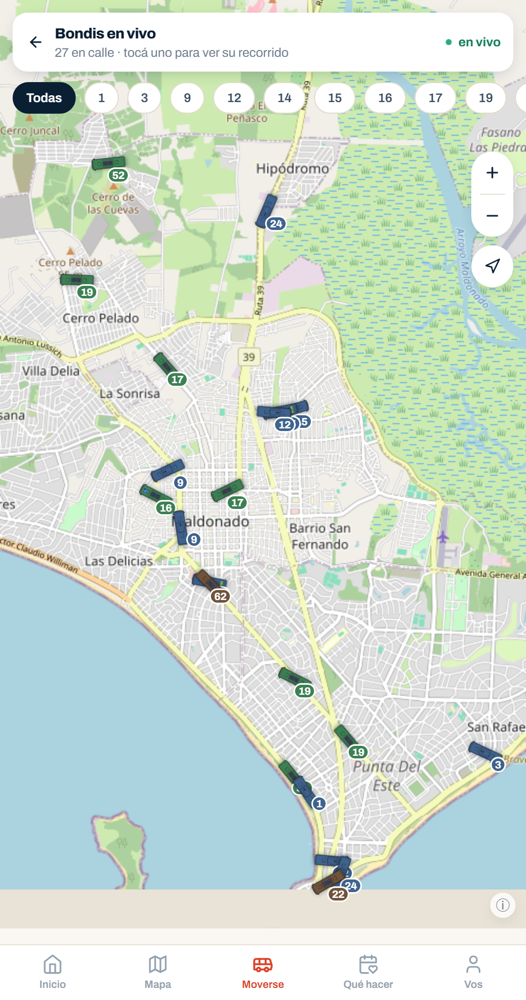
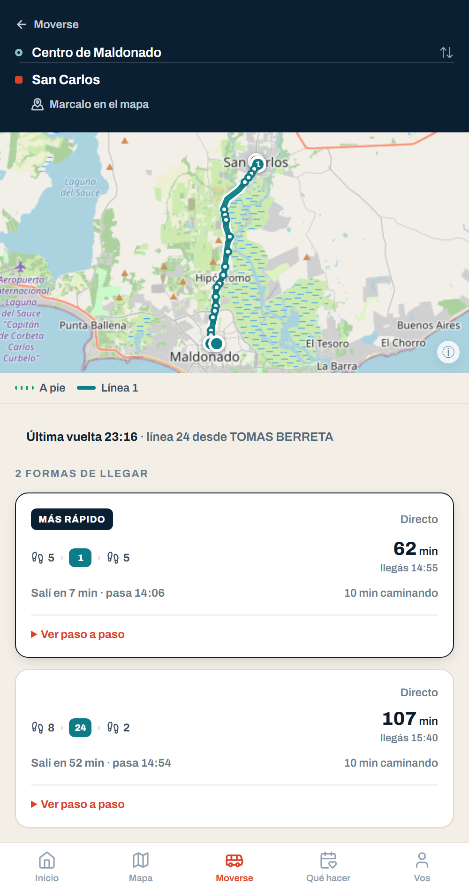
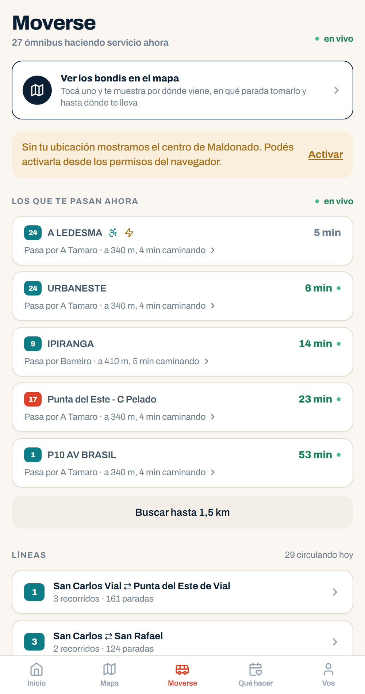

# Maldonado Moverse

Aplicación web para moverse y enterarse de lo que pasa en el departamento de
Maldonado, Uruguay: dónde está el ómnibus que se está esperando, cómo llegar de
un punto a otro, qué hay para hacer esta semana y qué se anunció hoy.

La información del departamento está repartida entre las páginas de tres
empresas de ómnibus, las agendas de la Intendencia, el portal de turismo y la
prensa local. Cada una con su formato, su horario de actualización y su propia
idea de qué es un evento. Este proyecto junta todo eso en un solo lugar y lo
presenta como se usa: desde el teléfono, parado en la vereda, con una mano.



## Qué resuelve

| Necesidad | Cómo la resuelve el sistema |
|---|---|
| Saber si el ómnibus ya pasó o todavía viene | Ingesta de los feeds AVL de las tres empresas cada 15 s, con la posición proyectada sobre el recorrido reconstruido de la línea que está haciendo ese coche |
| Saber en qué parada esperarlo y si se llega a tiempo | `CatchBusService` compara la caminata ruteada por calle contra la velocidad medida de esa línea, y responde la parada concreta o el motivo por el que no se llega |
| Ir de un punto cualquiera a otro | Planificador que arma una línea de tiempo (caminata, espera, viaje) en vez de sumar duraciones, y acepta como destino un punto marcado en el mapa, no sólo lugares con nombre |
| Saber dónde bajarse, ya arriba del ómnibus | `RideService` sigue el coche y avisa por metros —no por cantidad de paradas— cuándo tocar el timbre |
| Saber a qué hora sale el último de vuelta | El planificador devuelve la última vuelta junto con la ida, antes de que la persona salga |
| Enterarse de qué hay para hacer | Ingesta diaria de las agendas públicas y la prensa local, con detección de fecha, lugar, organizador y precio sobre texto en castellano |
| Encontrar un destino escrito como lo escribe la gente | Búsqueda sobre atractivos, paradas y lugares con nombre importados de OpenStreetMap, tolerante a acentos, abreviaturas y orden de palabras |
| Que un editor municipal corrija sin pelearse con el robot | Backoffice con roles por área; una fila corregida a mano queda marcada y la ingesta automática no vuelve a pisarla |

## Stack

| Capa | Tecnología |
|---|---|
| Aplicación pública | React 18, Vite 5, TailwindCSS 3.4, React Router 6, Zustand, i18next |
| Cartografía | Leaflet 1.9 con react-leaflet 4, teselas raster de OpenStreetMap |
| Backoffice | React 18, Vite 5, TanStack Query 5, TailwindCSS 3.3 |
| API | NestJS 10, TypeORM 0.3, PostgreSQL con `pg` 8, Swagger/OpenAPI |
| Autenticación | JWT con Passport, bcrypt, guardas de rol propias |
| Validación | class-validator y class-transformer en la API, Zod y react-hook-form en el cliente |
| Ruteo geográfico | OSRM (perfiles `driving` para recorridos y `foot` para caminatas) |
| Extracción de horarios | Python 3 sobre los PDF que publican las empresas |
| Pruebas | Jest en la API, Vitest y Cypress en el cliente |
| Entorno | Node 22, npm workspaces, TypeScript 5.3 |

## Arquitectura

El repositorio es un monorepo de npm workspaces con tres aplicaciones —la
pública, el backoffice y la API— y una carpeta de herramientas de extracción en
Python. Lo que sigue son las decisiones que costaron trabajo, incluidas las que
cambiaron sobre la marcha.

### El orden de paradas de cada línea no existía

No hay GTFS público de Maldonado y la tabla de paradas por recorrido estaba
vacía. Sin ese orden no hay tiempo estimado de llegada, no hay "dónde me bajo"
y el planificador no puede dar un resultado correcto.

Se reconstruye por dos caminos, en orden de confianza. El primero es dato, no
inferencia: cada posición del feed trae la parada por la que el coche acaba de
pasar, así que las empresas están diciendo, viaje a viaje, qué paradas hace cada
recorrido. El segundo es un respaldo por cercanía al trazo —una parada a menos
de 40 m se da por servida—, que reparte mal en avenidas con cantero y en el
centro, donde tres líneas comparten cuadra, y por eso es el segundo.

El orden se guarda por itinerario y no por línea: la 24 hace cuatro recorridos
por avenidas distintas, y una sola secuencia por línea calculaba los tiempos
sobre el recorrido equivocado.

### La coordenada de cada parada se mide

Cargar paradas a mano sobre un mapa no escala y no se puede auditar. En su
lugar, cuando un coche informa que acaba de pasar la parada X y además está
detenido, ese punto es la parada. Como las posiciones se podan a las 24 h, esos
avistamientos se guardan aparte en `stop_observations` y la precisión mejora
sola con los días.

El primer estimador interpolaba entre dos posiciones consecutivas. Medido
contra los nodos relevados de OpenStreetMap, que son la única verdad de campo
independiente disponible, quedó claro que no alcanzaba:

```
cd apps/backend && npx jest stop-placement
# detenciones (n=160): p50=13m | intervalo (n=142): p50=57m
```

Cada parada lleva además su error estimado. La aplicación lo usa para no
prometer una esquina que no puede afirmar: con más de 60 m dice "la parada está
por acá" en lugar de "esperá acá", y el planificador cobra esos metros de más
como caminata extra en vez de descartar la parada.

### La velocidad de una línea se mide, no se supone

El planificador usaba una constante de 18 km/h para todas las líneas, y no hay
un número que sirva para las dos mitades del departamento: el mismo recorrido
mezcla ruta y ciudad, y su promedio no es la velocidad de ninguno de los dos
tramos. `LineSpeedService` la calcula del GPS de las últimas 24 h y por celdas
geográficas: la 15 promedia 30 km/h porque son treinta kilómetros de ruta, pero
en el centro anda a 20, y las paradas donde alguien la alcanza están en el
centro.

Ese detalle decidió mover al backend dos cálculos que antes vivían en la
pantalla. Con constantes escritas a mano —peatón a 57 m/min efectivos contra
los 80 que usa el resto de la aplicación, ómnibus a 300 m/min fijos— la
respuesta a "¿llego a tomarlo?" era sistemáticamente que no.

### El planificador es una línea de tiempo, no una suma

Sumar caminata más espera más viaje, con la espera tomada del coche más próximo
a la parada, produce el peor error posible en una aplicación de transporte:
ofrecer un ómnibus que no se llega a tomar. Si el coche está a un minuto de la
parada y la parada está a cuatro cuadras, ese coche ya se fue. Acá el reloj
corre, y sobre él se aplican cuatro reglas:

1. **Se puede tomar.** Un coche cuenta sólo si llega a la parada después de que
   uno llegó, con margen. Si no hay unidad en vivo que sirva, la próxima salida
   sale del horario publicado; y si no hay horario cargado para la temporada,
   de la frecuencia medida. En ese orden: el GPS es más certero que el papel, y
   el papel más que una estimación.
2. **El ómnibus tiene que servir para algo.** Si caminando el mismo tramo se
   llega igual o antes, el tramo se descarta.
3. **La línea tiene que estar circulando.** Prometer "esperá diez minutos"
   cuando ningún coche está haciendo ese recorrido es inventar un viaje.
4. **Sin transbordos si hay una línea que te deja.** Abajo de 11 km el
   transbordo no compite con el directo por costo: directamente no se calcula.

Las paradas candidatas se eligen con cupo por itinerario y no como "las N más
cercanas". En Maldonado Nuevo hay 44 paradas a menos de 900 m de cualquier
punto, y las doce más cercanas resultaron ser todas del sentido contrario: el
viaje Hospital → Maldonado Nuevo se quedaba sin opciones aunque la 16 pasara
por ahí, porque su parada de ida caía en el puesto dieciséis.



### Ya arriba del ómnibus, el aviso va por metros

"Faltan dos paradas" no dice nada en este departamento: dos paradas en el centro
son dos cuadras y dos paradas en la Ruta 10 son tres kilómetros. `RideService`
elige la bajada que minimiza ómnibus más caminata —no la parada más cercana al
destino— y avisa por distancia. Esa elección es estable mientras el coche
avanza, porque los minutos hasta todas las paradas de adelante bajan por igual,
que es lo que permite mostrarla sin que parpadee.

La cuadra funciona como unidad hasta unas doce; más allá deja de servir, porque
la conversión honesta de un viaje Maldonado–San Carlos da 207 cuadras. De ahí
para arriba la pantalla pasa a minutos y kilómetros.

### Decir "no sabemos" en vez de mentir

Los feeds no son la API de una empresa grande: son servidores AVL detrás de DNS
dinámico, sobre la conexión de la oficina de una empresa de ómnibus. Se caen.
El problema no es que se caigan, sino qué dice la aplicación cuando pasa: "no
hay ómnibus en camino" es una mentira con cara de dato, porque no distingue
entre *no viene ninguno* y *no tenemos idea*.

`FeedHealthService` guarda por feed cómo salió el último intento y cuándo fue el
último que salió bien, con una racha de fallos consecutivos para no confundir un
arranque con una caída. Con eso la aplicación puede decir "el GPS de esa empresa
no está respondiendo, te muestro el horario". El mismo criterio aplica arriba
del ómnibus: si el coche deja de reportar, la pantalla lo dice en vez de seguir
contando cuadras con la última posición buena.

### El fondo del mapa volvió a ser raster

El mapa se dibujaba con teselas vectoriales sobre WebGL. Se cambió por dos
motivos, y el segundo es el que importa: **el mapa desaparecía solo**. El
navegador tiene un tope de contextos WebGL vivos —del orden de 16 en escritorio
y bastante menos en un teléfono— y al pasarse mata los más viejos sin avisar,
dejando esos canvas en blanco para siempre. Acá se abrían de a dos por pantalla,
uno por cada mapa montado y otro más cada vez que se comprobaba si había WebGL,
porque esa comprobación creaba un canvas que no se liberaba nunca. Ir y venir
entre pantallas los acumulaba hasta romper.

Las teselas raster son etiquetas `` que Leaflet mete y saca del DOM: no hay
contexto gráfico que perder ni tope que agotar, y funcionan igual con la
aceleración por hardware apagada.

### Las entidades se registran por módulo

La API se empaqueta con webpack en un único `dist/main.js`, así que el patrón
habitual de TypeORM —barrer el disco buscando `*.entity.js`— no encontraba nada.
El origen de datos arrancaba sin ninguna entidad y cualquier endpoint que usara
un repositorio moría con "No metadata for BusStop was found": un error 500 sin
más explicación. Cada módulo declara ahora sus entidades con
`TypeOrmModule.forFeature`, y el modelo completo se registra aunque algunas
tablas todavía no se consulten, porque TypeORM necesita las dos puntas de cada
relación para levantar.

### La agenda se ingiere sola, pero un editor siempre gana

El scraper recorre las agendas públicas y la prensa local, y de cada nota extrae
la fecha en castellano, el lugar, el organizador y el precio. Tres reglas lo
hacen convivible con el trabajo humano:

- La clave del upsert es `(source, source_id)`: la misma nota puede reaparecer
  en el listado durante semanas y tiene que actualizar la fila, no duplicarla.
- Una fila marcada como editada a mano no se toca nunca más. Si alguien de
  Cultura corrigió el horario, la corrida siguiente no puede pisarlo.
- Lo que el parser extrae con poca confianza entra como pendiente y no se
  muestra hasta que un editor lo aprueba. Publicar una fecha mal parseada es
  peor que no publicar nada.

## Módulos y funcionalidades

### Aplicación pública

| Sección | Qué hace |
|---|---|
| Inicio | Entrada única: qué pasa hoy, accesos al mapa y a moverse |
| Mapa | Atractivos y lugares del departamento por capas |
| Moverse | Cuántos ómnibus están en servicio ahora, los que pasan cerca, las líneas con ida y vuelta |
| Bondis en vivo | Mapa de coches reportando, con el recorrido dibujado al tocar uno y la parada donde conviene esperarlo |
| Planificador | Origen y destino, opciones comparables, viaje dibujado sobre el recorrido publicado y última vuelta del día |
| A bordo | Seguimiento del coche tomado, con aviso de cuándo bajarse |
| Parada | Llegadas de esa parada y horario publicado de cada línea |
| QR de parada | Página y escáner para llegar a una parada desde el cartel de la calle |
| Qué hacer | Agenda de eventos con detalle |
| Noticias | Comunicaciones institucionales |
| Buscador | Búsqueda transversal sobre lugares, eventos y paradas |



### Backoffice

| Pantalla | Qué hace |
|---|---|
| Panel | Estado general y accesos |
| Lugares | Alta y edición de atractivos, con ubicación en mapa |
| Eventos | Edición de la agenda, aprobación de lo que quedó pendiente |
| Ingesta de eventos | Estado de las corridas del scraper y ejecución manual |
| Noticias | Comunicaciones institucionales |
| Transporte | Líneas, paradas y avisos de servicio |
| Usuarios | Alta y baja de cuentas del backoffice |
| Auditoría | Registro de quién cambió qué |

Los roles son `admin_sis`, `turismo`, `cultura`, `transporte`, `prensa` y
`lectura`, aplicados con una guarda propia sobre los controladores.

<!-- CAPTURA: backoffice, pantalla de eventos con uno pendiente de aprobación -->

### Procesos automáticos

| Proceso | Frecuencia | Qué hace |
|---|---|---|
| Ingesta AVL | 15 s | Lee los feeds de las tres empresas y normaliza posiciones |
| Poda de posiciones | continua | Descarta lo que pasa de la ventana de retención |
| Avistamientos de parada | 1 h | Guarda los coches detenidos en una parada para afinar su coordenada |
| Catálogo de paradas | diario | Reconstruye el catálogo desde lo que informa el feed |
| Emparejado de recorridos | 6 h | Decide qué recorrido oficial está haciendo cada coche |
| Ingesta de agenda | diaria | Recorre las fuentes, extrae y clasifica eventos |

### Herramientas de extracción

`apps/backend/tools/horarios` contiene los extractores en Python de los horarios
que las empresas publican en PDF, con un esquema de salida documentado y un
verificador. Se corren a mano: los horarios cambian por temporada, y conviene
mirar el resultado antes de cargarlo.

## Modelo de datos

PostgreSQL. El esquema, las migraciones y los seeds se mantienen fuera de este
repositorio; lo que sigue son los dominios y las tablas que el código consulta.

| Dominio | Tablas principales |
|---|---|
| Transporte, catálogo | `bus_stops`, `bus_routes`, `official_routes`, `route_shapes`, `itinerary_stops`, `line_schedules` |
| Transporte, tiempo real | `vehicle_positions`, `stop_observations`, `transport_alerts` |
| Referencia geográfica | `geo_places`, `osm_bus_stops` |
| Turismo y cultura | `places`, `events`, `event_sources`, `event_scrape_runs` |
| Comunicación | `news` |
| Backoffice | `admin_users`, `audit_log` |

Dos decisiones sobre dónde vive la lógica. Las consultas geográficas y de
agregación pesadas —velocidad por celda, posiciones más recientes por vehículo,
rachas de detención— se resuelven en SQL y no en JavaScript: son ventanas sobre
tablas que crecen rápido y traerlas al proceso para recorrerlas sería pagar el
transporte de datos que no se usan. El resto de la lógica de dominio vive en los
servicios de NestJS, donde se puede leer y probar.

`vehicle_positions` es la tabla que más crece: se poda por antigüedad, y lo que
tiene que sobrevivir a esa poda —los avistamientos que sirven para ubicar
paradas— se copia a su propia tabla antes.

## Rendimiento y seguridad

**Rendimiento.** El orden de las operaciones caras es deliberado. En "¿llego a
tomar este ómnibus?" primero se descartan candidatas con cuentas en memoria y en
línea recta —la recta es cota inferior de la caminata real, así que si ni así se
llega, rutear por calle va a dar peor— y recién después se sale a la red por las
cuatro más cercanas, en paralelo y con un techo de tiempo que cae a la
estimación recta si el ruteador se demora. Las distancias acumuladas de cada
trazo se calculan una vez y se cachean contra el propio arreglo de puntos. Las
caminatas se cachean por coordenada redondeada, que es lo que hace barato
consultar la pantalla de a bordo cada ocho segundos.

**Seguridad y datos personales.** El backoffice va con JWT y bcrypt, con guardas
de rol por controlador y registro de auditoría de los cambios. Las coordenadas
de origen y destino de una persona viajan por POST y no por query string: no
tienen por qué quedar en la barra del navegador, en el historial ni en los logs
de acceso del servidor. Donde alcanza con menos precisión —ordenar resultados
por cercanía— la ubicación se redondea antes de salir del dispositivo. Los feeds
AVL incluyen datos que identifican al personal de las empresas: no se leen, no
se guardan y no se exponen, por la Ley 18.331 de Protección de Datos Personales.

Las direcciones de los feeds AVL de las empresas no están en el repositorio. Se
configuran por entorno, y el feed que no tenga URL simplemente no se consulta.

## Estructura del repositorio

```
.
├── apps
│   ├── frontend        Aplicación pública en React: 16 pantallas, mapas,
│   │                   planificador y seguimiento en vivo
│   ├── admin           Backoffice municipal: alta de contenido, aprobación
│   │                   de la agenda ingerida, usuarios y auditoría
│   └── backend         API NestJS: 21 controladores, 28 servicios, la
│                       ingesta AVL y los procesos programados
├── package.json        Workspaces y comandos del monorepo
├── tsconfig.json       Configuración TypeScript compartida
├── .eslintrc.json      Reglas de linter comunes
└── .prettierrc.json    Formato común
```

Dentro de la API, `src/modules/transporte` concentra 48 archivos: es donde vive
casi todo lo que este proyecto tiene de particular.

## Puesta en marcha

Requisitos: Node 22 o superior, npm 10 y una base PostgreSQL accesible.

```bash
npm install
```

Cada aplicación toma su configuración de un archivo `.env` propio. Los tres
`.env.example` documentan cada variable:

```bash
cp apps/backend/.env.example  apps/backend/.env
cp apps/frontend/.env.example apps/frontend/.env
cp apps/admin/.env.example    apps/admin/.env
```

Como mínimo hay que completar `DATABASE_URL` y `JWT_SECRET` en la API, y
`VITE_API_URL` en las dos aplicaciones cliente. El esquema de la base no se
distribuye con el repositorio.

```bash
npm run dev              # API y aplicación pública a la vez
npm run dev:backend      # sólo la API           http://localhost:3000/api/v1
npm run dev:frontend     # sólo la app pública   http://localhost:5173
npm run build            # compila los workspaces
npm run lint             # linter en los workspaces
```

Pruebas de la API, que corren sobre datos fijos y no necesitan base ni GPS:

```bash
cd apps/backend && npx jest
```

Con `ENABLE_SWAGGER=true`, la documentación de la API queda en
`/api/v1/docs`.

## Créditos

Desarrollo y mantenimiento: **PulsarMoon** · [pulsarmoon.com](https://pulsarmoon.com) · [contacto@pulsarmoon.com](mailto:contacto@pulsarmoon.com) · 091 722 750

Cartografía y datos de lugares: OpenStreetMap y sus colaboradores, bajo licencia
ODbL. Recorridos y horarios de las líneas: publicaciones de CODESA, Maldonado
Turismo y Micro.

## Licencia

Software propietario. Copyright © 2026 Mauro Hernández — PulsarMoon. Todos los
derechos reservados. Ver [LICENSE](LICENSE).
